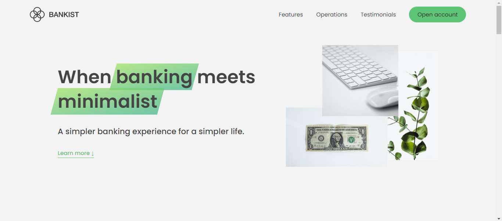
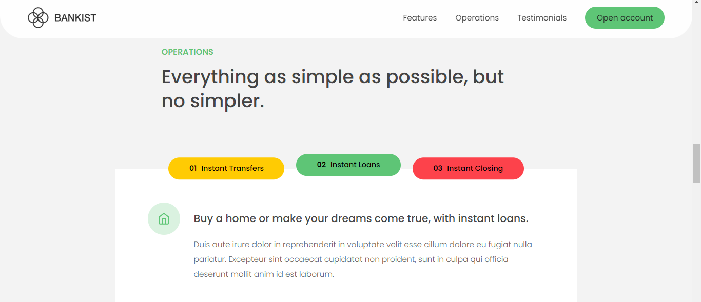

# Bankist Web
## Website For Introduce [Bankist](https://smsajjadsm.github.io/Bankist/) ?!!


[Demo of Bankist-Web](https://smsajjadsm.github.io/Bankist-Web/)
===





## Installation


First clone project ...

```sh
https://github.com/SMsajjadSM/Bankist-Web.git
```

Install the dependencies and devDependencies

```sh
npm i
```


#### How to support?
 If you enjoyed and used this post,
I would appreciate it if you could
support me by giving me a ⭐

[SMsajjadSM](https://github.com/SMsajjadSM/Bankist-Web)
